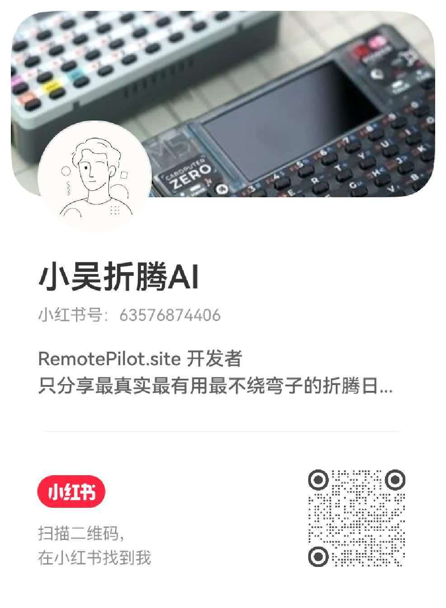

# RemotePilot — 用 Apple TV 遥控器或 iPhone 控制 Mac

**RemotePilot** 把 Apple TV 遥控器 / Siri Remote（A1962、A2540、A2854）变成 Mac 的无线触控板、按键映射控制器和语音输入设备；配套 iPhone 客户端还能提供虚拟遥控器、触控板、Launcher 和游戏键盘。它适用于网页与文档浏览、演示、媒体控制、辅助输入，以及 Codex 等 AI 编程与 Vibe Coding 工作流。

RemotePilot turns an Apple TV Siri Remote or iPhone into a trackpad, customizable shortcut controller, voice-input device, app launcher, and game keyboard for Mac.

> 本仓库是 RemotePilot 的官方 **macOS 二进制发布与 OTA 更新仓库**，提供安装包、版本说明和 Sparkle 更新文件，不包含产品源代码，也不提供 iOS 安装包。

## 下载与版本

| 通道 | 当前版本 | 下载与说明 |
| --- | --- | --- |
| Stable 稳定版 | **1.1.3** | [下载稳定版 RemotePilot.dmg](https://github.com/kai-wu-cortex/RemotePilot-Releases/releases/latest/download/RemotePilot.dmg) · [查看版本页](https://github.com/kai-wu-cortex/RemotePilot-Releases/releases/tag/v1.1.3) |
| Nightly 预览版 | **1.1.5-nightly.4** | [下载预览版 RemotePilot.dmg](https://github.com/kai-wu-cortex/RemotePilot-Releases/releases/download/v1.1.5-nightly.4/RemotePilot.dmg) · [查看更新内容](https://github.com/kai-wu-cortex/RemotePilot-Releases/releases/tag/v1.1.5-nightly.4) |

支持 Apple Silicon Mac（M1 及后续芯片）和 macOS 12 或更高版本。Nightly 用于抢先体验与反馈，可能不如 Stable 稳定；它**不会替换**稳定版的 `releases/latest` 下载入口。

## Mac 端主要功能

- **Siri Remote 触控板**：用遥控器触控面移动 Mac 指针，执行点击、拖动与滚动；支持 A1962、A2540、A2854 的设备差异设置。
- **按键映射与快捷键**：把实体按键映射为键盘组合键、App 专属操作、系统与媒体控制，也可配置长按、双击和按住/松开行为。
- **外圈三模式**：在模拟触控板滚动、切换应用和移动输入文字光标之间切换；菜单栏显示三点模式指示器，并可设置全局快捷键。
- **虚拟九宫格键盘**：使用遥控器触控面输入字母、数字和标点，在不拿起实体键盘时完成短文本输入。
- **语音输入与转写**：使用 Mac 或遥控器麦克风语音输入；RemotePilot 识别时显示实时转写胶囊，结束后尝试将结果送回原输入框。
- **Typeless 与第三方输入法工作流**：将遥控器按键用于语音口述、提问、翻译或已安装输入法的快捷操作。实际可用性取决于 macOS 权限和输入法设置。
- **状态与配置**：菜单栏查看遥控器连接、电量和当前模式；按应用保存映射，并可手动导入、导出配置。应用内更新安装前会自动备份当前映射。

## 配套 iPhone 客户端能做什么

iPhone 客户端与 Mac 端 RemotePilot 配对后，可作为另一种输入设备使用；**本仓库的 DMG 仅安装 Mac 端，不包含 iPhone App**。

- **虚拟遥控器与触控板**：从 iPhone 发送遥控按键的按下/松开、指针移动、点击、拖动和连续滚动。
- **iPhone 麦克风语音输入**：按住说话，将音频传给 Mac 识别，并在手机上查看实时状态、音量波形和转写文字。
- **Launcher 与自定义 Deck**：查看从 Mac 同步的应用图标和运行状态，快速打开应用；将应用、常用操作和自定义快捷键编排成个人控制面板。
- **游戏键盘**：横屏使用可编辑的按键、摇杆和滑杆布局，将游戏或创作软件所需的键盘操作发送给 Mac。
- **Mac 控制栏**：从手机触发亮度、音量、媒体播放、Escape、调度中心等系统动作；它是操作面板，不是对 macOS 原生 Touch Bar 内容的镜像。
- **配对与连接**：首次连接需在两端确认配对码；触控与按键通过低延迟蓝牙通道传输，语音可通过加密 Wi-Fi 传输并在网络异常时回退蓝牙。

## 最新 Nightly：1.1.5-nightly.4

2026 年 9 月 27 日的预览版新增外圈三模式与全局模式切换快捷键、向上/向下触控板滚动映射，并改进蓝牙耳机切换后的音量键映射保护、A2854 静音键及 macOS 27 的菜单栏与窗口行为。[阅读完整 Nightly 4 更新说明](https://github.com/kai-wu-cortex/RemotePilot-Releases/releases/tag/v1.1.5-nightly.4)。

本次预览版仅发布 Mac 安装包；Stable 和官网正式版下载不变。Nightly 4 使用 Apple Development 签名且未公证，首次打开可能需要在“系统设置 → 隐私与安全性”中手动允许运行。

## 快速开始

1. 按需要下载 [Stable 稳定版](https://github.com/kai-wu-cortex/RemotePilot-Releases/releases/latest/download/RemotePilot.dmg) 或 [Nightly 预览版](https://github.com/kai-wu-cortex/RemotePilot-Releases/releases/download/v1.1.5-nightly.4/RemotePilot.dmg)。
2. 打开 DMG，将 RemotePilot 拖入“应用程序”文件夹。
3. 在 macOS 蓝牙设置中配对 Siri Remote；不同型号的配对按键不同，请跟随应用内设备指南。
4. 按应用指引授予辅助功能、输入监控、蓝牙及所需的麦克风权限，然后配置触控与按键映射。
5. 如使用配套 iPhone 客户端，在两端核对配对码后连接同一台 Mac。

实际功能可能因遥控器硬件、macOS 版本、输入法、音频输出设备和系统权限而异。

## 自动更新与下载安全

RemotePilot 使用 Sparkle 验证签名并安装更新。Stable 通道读取本仓库的 `releases/latest`；在 Mac App 中选择“预览版 Nightly”后，更新器会查找本仓库最新的 Nightly 预发布版本。请只从[官网](https://remotepilot.site)或本仓库下载发行版本。

## 官方链接

- [RemotePilot 官网](https://remotepilot.site)
- [使用指南](https://remotepilot.site/#guide)
- [Stable 与 Nightly 版本列表](https://github.com/kai-wu-cortex/RemotePilot-Releases/releases)

## 关注小红书

关注 **小吴折腾 AI**，获取 Apple TV 遥控器连接教程、RemotePilot 使用技巧和 Vibe Coding 实践。小红书号：`63576874406`。

  

## 软件许可

RemotePilot 是**非开源的专有软件（Proprietary Software）**。本仓库公开可见不代表软件以开源方式授权，也不授予复制、修改、反向工程、再分发或商业转售权利。详细条款请阅读 [LICENSE](LICENSE)。

Copyright © 2026 RemotePilot. All rights reserved.
